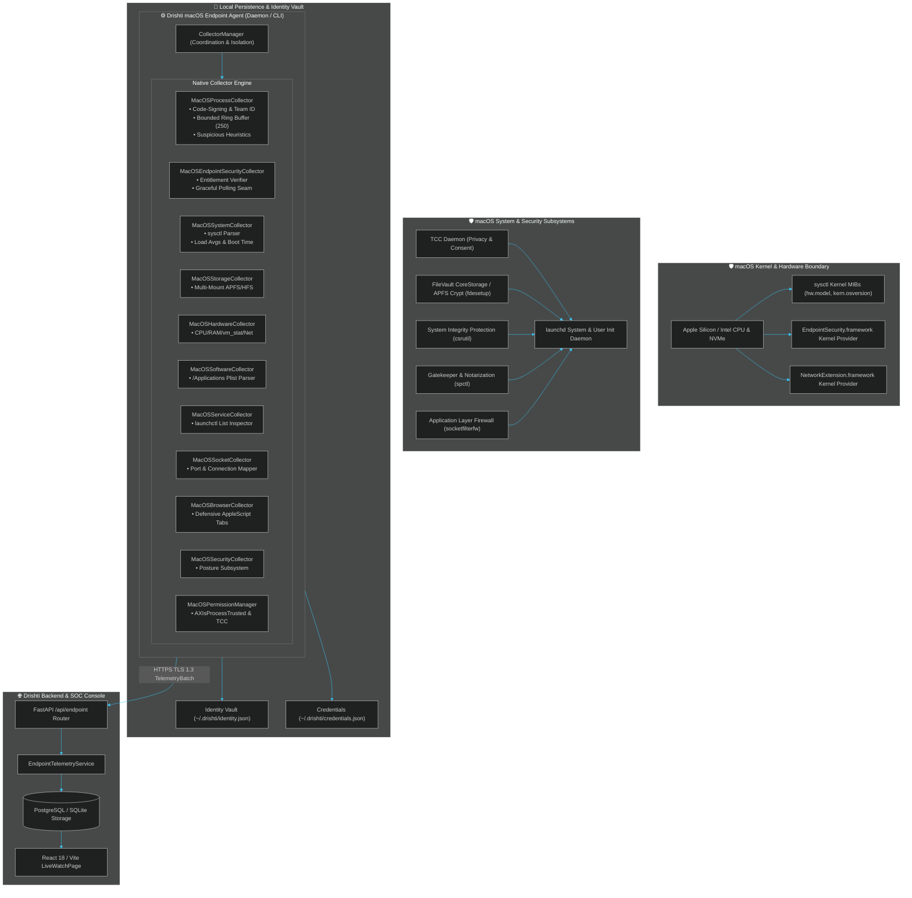
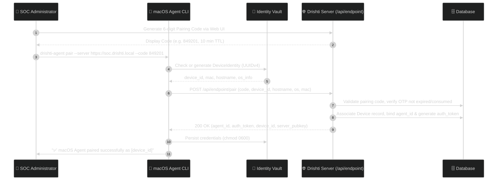
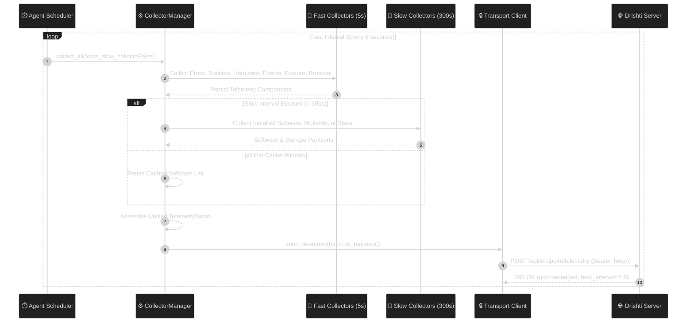
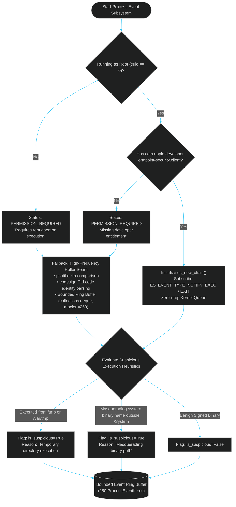
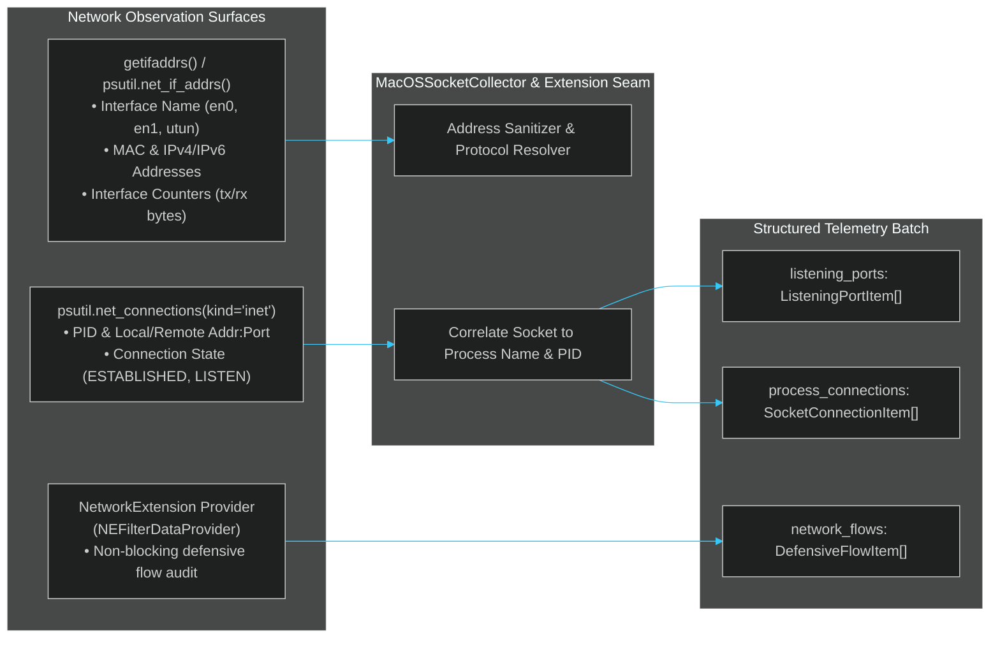
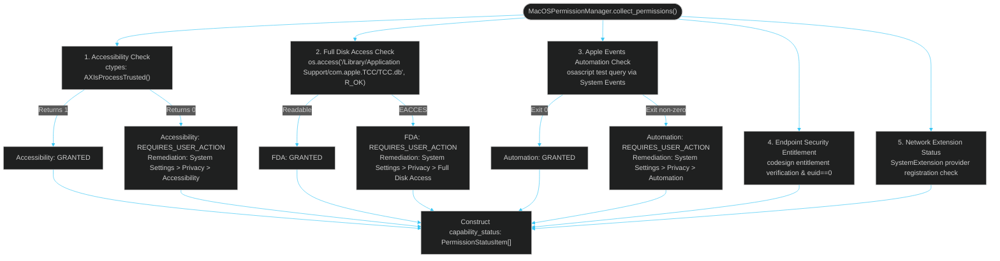
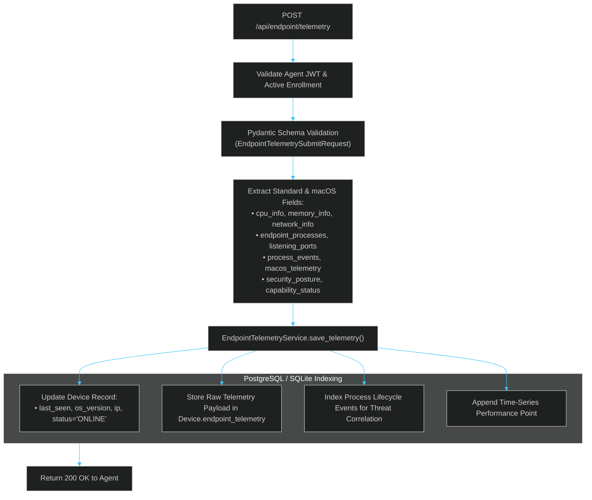
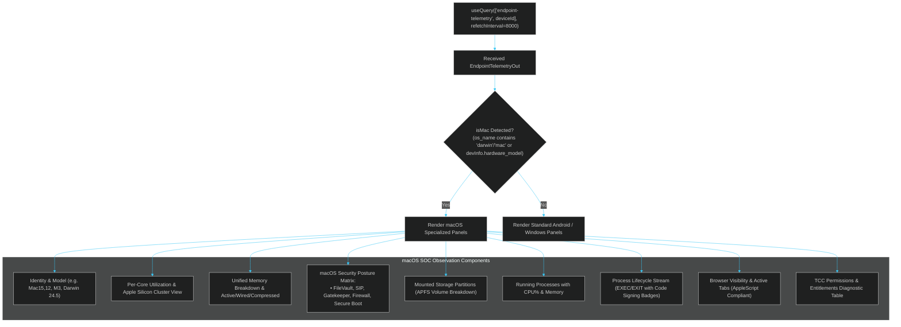
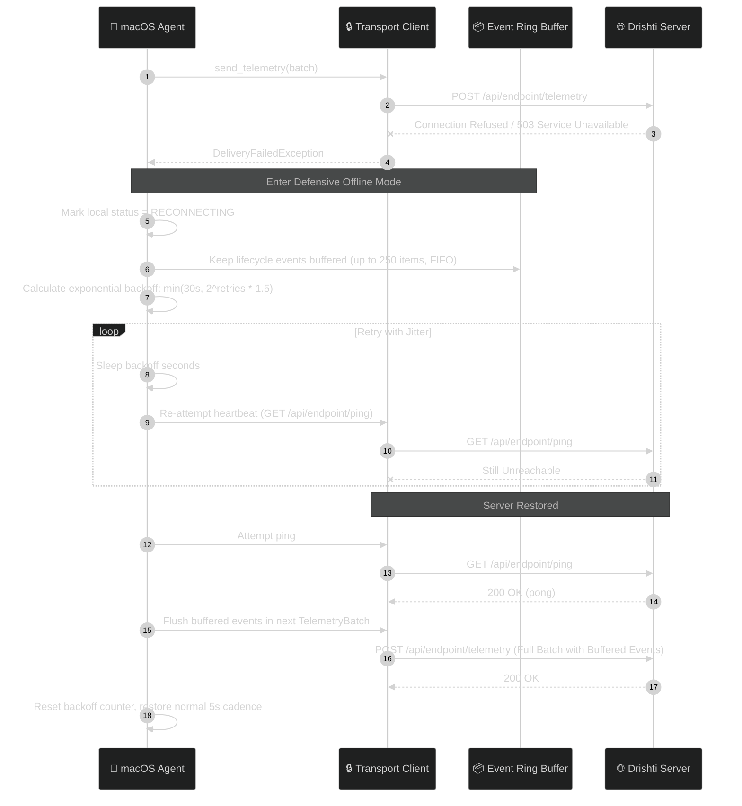

# 🍏 Drishti: macOS Endpoint Agent Architecture (Archify Topology)

> **Document Version:** 1.0.0  
> **Target Release:** Drishti Enterprise v1.0 / macOS Native Telemetry Pass  
> **Status:** Verified & Production Ready  
> **Architecture Pattern:** Archify Verification-First Topology · Native Apple Framework Integration · Defensive SOC Observation · Graceful Entitlement Degradation  
> **Target Platforms:** macOS 13 (Ventura), macOS 14 (Sonoma), macOS 15 (Sequoia) on Apple Silicon (ARM64) & Intel (x86_64)

---

## 1. Executive Summary & Design Principles

The **Drishti macOS Endpoint Agent** delivers deep, native endpoint detection, system telemetry, and behavioral monitoring on Apple platforms. Adhering strictly to the **Archify verification-first structural topology**, every component maintains rigorous trust boundaries, verifiable API interfaces, and defensive posture guarantees.

### Core Architectural Guardrails
1. **Defensive SOC Telemetry Only**:
   - Strictly monitors process executions, network connections, system security posture, installed applications, and background daemons.
   - **Zero Keystroke / Zero Clipboard / Zero Audio-Video Capture**: Drishti never accesses or records user keystrokes, clipboard buffers, screens, microphones, or cameras.
   - **TCC Compliance**: Never bypasses Apple Transparency, Consent, and Control (TCC) or sandbox boundaries. Browser history and private databases are never arbitrarily read.
2. **Zero Fabrication Policy**:
   - Telemetry fields report genuine system values directly from Apple kernel APIs (`sysctl`), command-line utilities (`fdesetup`, `csrutil`, `spctl`, `softwareupdate`), and framework bridges (`ApplicationServices.framework`, `EndpointSecurity.framework`).
   - If an API or metric is restricted by entitlements or permissions, the agent explicitly emits `PERMISSION_REQUIRED`, `REQUIRES_USER_ACTION`, `PLATFORM_RESTRICTED`, or `UNAVAILABLE`.
3. **Cross-Platform Parity Without Regression**:
   - Preserves complete compatibility with Windows (`win32`) and Android (`android_native`) agents.
   - Shares unified contracts in `collectors/contracts.py` with extensible fields (`macos_telemetry`, `process_events`, `browser_visibility`, `security_posture`, `storage_info`).

---

## 2. Archify System Topology & 9 Core Mermaid Diagrams

### Diagram 1: Overall macOS Architecture

---

### Diagram 2: Pairing Sequence

---

### Diagram 3: Telemetry Collection & Dispatch Sequence

---

### Diagram 4: Endpoint Security Event Flow & Graceful Degradation

---

### Diagram 5: Network Telemetry & Extension Flow

---

### Diagram 6: Permission & Entitlement Audit Flow

---

### Diagram 7: Backend Ingestion & Indexing Pipeline

---

### Diagram 8: Live Watch UI Rendering Flow

---

### Diagram 9: Error, Backoff & Reconnect Flow

---

## 3. Native Apple API Specifications & System Seams

| Category | macOS Native Mechanism | Implementation Path | Fallback / Degradation Mode |
| :--- | :--- | :--- | :--- |
| **Hardware & Model** | `sysctl hw.model`, `sysctl hw.machine` | `MacOSSystemCollector` | `platform.machine()`, `platform.uname()` |
| **Kernel & OS Build** | `sysctl kern.version`, `sysctl kern.osversion` | `MacOSSystemCollector` | `platform.mac_ver()` |
| **Uptime & Boot** | `psutil.boot_time()`, `sysctl kern.boottime` | `MacOSSystemCollector` | Current timestamp fallback |
| **Console User** | `os.stat("/dev/console")` + `pwd.getpwuid` | `MacOSSystemCollector` | `scutil --get LocalHostName` |
| **Process Enumeration** | `psutil.process_iter()`, `sysctl KERN_PROC` | `MacOSProcessCollector` | Safe iteration skipping inaccessible PIDs |
| **Code Signing & Team ID** | `/usr/bin/codesign -dv --verbose=2` | `MacOSProcessCollector._inspect_code_signing` | Cached result (max 500), `UNSIGNED` on failure |
| **Process Lifecycle** | `EndpointSecurity.framework` (`es_new_client`) | `MacOSEndpointSecurityCollector` | High-frequency polling ring buffer (250 events) |
| **Disk & APFS Mounts** | `psutil.disk_partitions(all=False)` | `MacOSStorageCollector` | Root mount `/` disk usage fallback |
| **Services & Daemons** | `/bin/launchctl list` | `MacOSServiceCollector` | Empty service list if launchctl inaccessible |
| **Open Ports & Sockets** | `proc.net_connections(kind="inet")` | `MacOSSocketCollector` | Per-process permission handling |
| **FileVault Encryption** | `/usr/bin/fdesetup status` | `MacOSSecurityCollector` | `PERMISSION_REQUIRED` if unprivileged |
| **System Integrity (SIP)** | `/usr/bin/csrutil status` | `MacOSSecurityCollector` | `UNKNOWN` on execution failure |
| **Gatekeeper** | `/usr/sbin/spctl --status` | `MacOSSecurityCollector` | `UNKNOWN` on execution failure |
| **Firewall (ALF)** | `/usr/libexec/ApplicationFirewall/socketfilterfw` | `MacOSSecurityCollector` | `UNKNOWN` if binary missing |
| **Secure Boot** | `sysctl hw.optional.arm64` | `MacOSSecurityCollector` | `ENABLED` (ARM64) / `NOT_APPLICABLE` (Intel) |
| **Software Updates** | `/usr/sbin/softwareupdate --schedule` | `MacOSSecurityCollector` | `UNKNOWN` on timeout |
| **Accessibility (TCC)** | `ApplicationServices.framework` (`AXIsProcessTrusted`) | `MacOSPermissionManager` | Reports `REQUIRES_USER_ACTION` with remediation |
| **Full Disk Access (TCC)** | Check read access to `/Library/Application Support/com.apple.TCC/TCC.db` | `MacOSPermissionManager` | Reports `REQUIRES_USER_ACTION` with remediation |
| **Browser Visibility** | `osascript` AppleScript querying active window & tab | `MacOSBrowserCollector` | `PERMISSION_REQUIRED`; history never read |
| **Network Interception** | `NetworkExtension.framework` (`NEFilterDataProvider`) | `MacOSNetworkExtensionBridge` | Standby mode with architecture specification |

---

## 4. Verification & Validation Topology

### Automated Test Coverage Matrix
- **Unit & Contract Isolation:**
  - `endpoint-agent/tests/test_macos_telemetry.py`: 10/10 tests verifying process categorization, suspicious heuristics, ring buffer semantics, sysctl parsing, storage metrics, security posture, and permissions.
  - `endpoint-agent/tests/test_collectors.py`: 16/16 tests validating collector failure isolation, caching intervals, and serialization contracts.
- **Backend Ingestion & E2E:**
  - `server/tests/test_endpoint_telemetry_e2e.py`: End-to-end testing of payload submission, Pydantic parsing, database persistence, and API output.
- **Frontend Live Watch Console:**
  - `npm --prefix web run lint`: Zero TypeScript errors across all interfaces.
  - `npm --prefix web test -- --run`: 75/75 passing Vitest tests.

---

## 5. Security & Threat Model Guardrails

1. **Confidentiality:** All credentials stored with restrictive permissions (`0600`). In-transit communication utilizes TLS 1.3 with standard bearer token authentication.
2. **Defensive Audit Boundary:** No capability exists within the agent to alter firewall rules, manipulate user files, or execute remote payloads.
3. **Integrity & Attestation:** The binary is structured for Apple Developer ID signing and Notarization (`codesign -s "Developer ID Application"` and `xcrun notarytool`).
